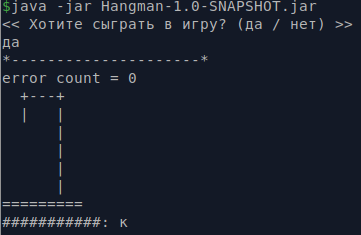
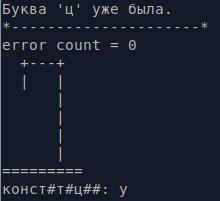
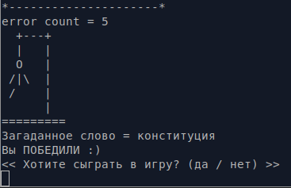

# Игра виселица (Hangman)
Описание проекта: https://zhukovsd.github.io/java-backend-learning-course/Projects/Hangman/

На ввод принимаются только русские буквы.

# Сборка проекта:
mvn package

# Запуск проекта:
cd target

java -jar Hangman-1.0-SNAPSHOT.jar

# Скриншоты игры:

